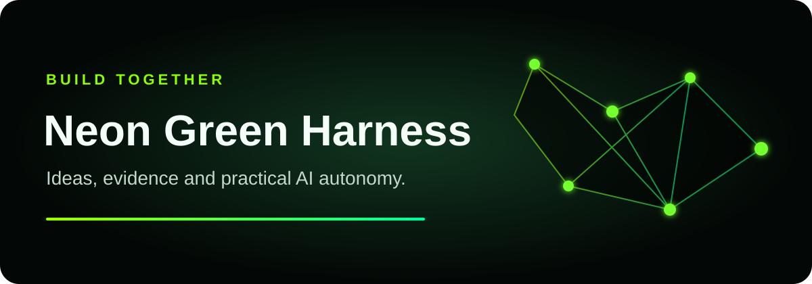
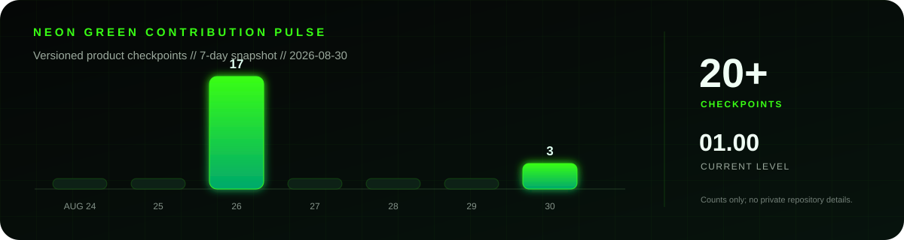

  

# Neon Green Harness Community

This is the public collaboration gateway for **Neon Green Harness**, a guided
multi-agent workflow system for people who want to start building with AI
without first becoming infrastructure experts.

The product source remains private during pre-production. This repository holds
public conversations, structured feedback and early community participation. It
does not contain the private product code.

## Choose a path

1. See the controlled
   [public project preview](https://f6z98p6zd7s5.github.io/neon-green-harness/).
2. Ask a question or discuss a direction in
   [Discussions](https://github.com/f6z98p6zd7s5/neon-green-harness-community/discussions).
3. Propose an improvement with the
   [Idea form](https://github.com/f6z98p6zd7s5/neon-green-harness-community/issues/new?template=idea.yml).
4. Report a public-preview bug with the
   [Bug form](https://github.com/f6z98p6zd7s5/neon-green-harness-community/issues/new?template=bug.yml).
5. Register public early-access interest with the
   [Interest form](https://github.com/f6z98p6zd7s5/neon-green-harness-community/issues/new?template=early-access.yml).
6. Read the living project
   [Wiki](https://github.com/f6z98p6zd7s5/neon-green-harness/wiki) for architecture,
   decisions and deliberate non-choices.

## Contribution pulse

This dated snapshot shows delivery frequency without publishing private commit
messages, task names or source code. The maintainer profile contains GitHub's
live contribution calendar.

## Privacy boundary

1. Everything posted here is public.
2. Do not post email addresses, phone numbers, passwords, tokens, private URLs,
   customer data or confidential project details.
3. Security vulnerabilities must follow [SECURITY.md](SECURITY.md), not a public
   Issue.
4. A separate private intake form will be added before personal data is
   requested.

## Current stage

1. Product: private pre-production.
2. Community gateway: early setup.
3. Public source: not yet available.
4. AI review: advisory; humans remain the final decision gate.
